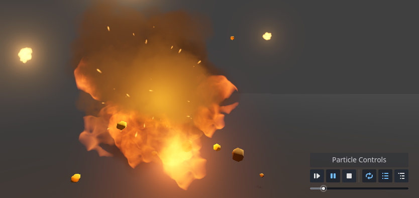

# Brackeys' Particle Controls
✨ Properly preview particles in Godot with this Editor Plugin. ✨

Working with particles just became fun! This plugin adds a control panel to the scene view for easily previewing your VFX in the Editor.

## Features

✅ Easily play, pause and scrub through particles.

✅ No need to change properties in the inspector. No more forgetting to enable one-shot before playing the game!

✅ Preview neighboring or child particle nodes at the same time. Great for combining multiple particle systems.

✅ Works for all particle nodes (GPUParticles3D, GPUParticles2D, CPUParticles3D, CPUParticles2D).

✅ Works by creating a duplicate of the particles for previewing. It never touches your nodes!

## Installing
Add the *addons* folder to your Godot project. If there is already an *addons* folder, just add the *brackeys_particle_controls* folder to it.

> Last tested with Godot 4.4.1.

## License
This plugin is made available under the MIT license. For more info see [LICENSE](./LICENSE).